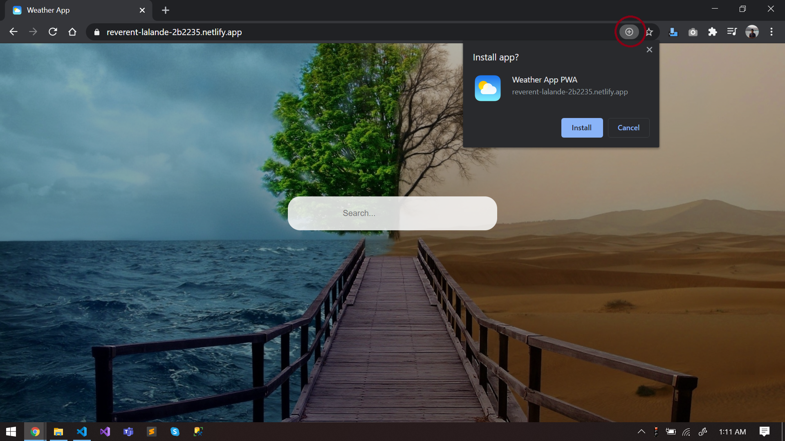

# Progressive Web App (PWA)

1. Build react App
2. Service Worker
3. mainfest.json
4. Deployment
5. Install App on Mobile/Desktop
6. Resource


Progressive Web Apps provide you with a unique opportunity to deliver a web experience your users will love. Using the latest web features to bring native-like capabilities and reliability, Progressive Web Apps allow what you build to be installed by anyone, anywhere, on any device with a single codebase.
- Progressive Discoverable
- Installable Works Offline

## 1. Build react App
```sh
npm init react-app pwt_react_app
```
We are using `Axios` to make a GET request to the API for the weather data.
```sh
npm install --save axios
```
- refer code in the repo for further understanding

## 2. Service Worker
- From here on, We will focus on the `public` folder. not on the `src` folder.

### 2.1. Adding service worker
- Service Worker:
    - A javascript file that runs all the time.
    - as soon as you open the page it starts running and even runs after the page is close.
    - can send push notification from a mobile phone.
    - can also show something to the page even if you're offline.

#### 2.1.1. Register Service worker
- Add following code in index.html after `<div id="root"></div>`.
```js
<script>
    if('serviceWorker' in navigator) {
    window.addEventListener('load', () => {
        navigator.serviceWorker.register('./serviceworker.js')
            .then((reg) => console.log('Success: ', reg.scope))
            .catch((err) => console.log('Failure: ', err));
        })
    }
</script>
```

#### 2.1.2. Service Workers in Developer tools
- Chrome Developer Tools -> Application -> Service Workers, check the "Update on reload" checkbox for testing our service worker.

### 2.2. Implementing Service Worker
- three steps:
    1. Install Service worker: Open cache in storage and add above CACHE_NAME in it
    2. Listen for requests
    3. Activate the Service Worker: We often gonna have a lot of version of cache, in here we going to remove all previous cache and just keep the new one

add following code in serviceworker.js
```js
const CACHE_NAME = "version-1"; // Storage for browser
const urlsToCache = [ 'index.html', 'offline.html' ];
const self = this;
// Install SW
self.addEventListener('install', (event) => {
    event.waitUntil(caches.open(CACHE_NAME).then((cache) => {
                console.log('Opened cache');
                return cache.addAll(urlsToCache);
            })
    )
});
// Listen for requests
self.addEventListener('fetch', (event) => {
    event.respondWith(caches.match(event.request).then(() => {
                return fetch(event.request).catch(() => caches.match('offline.html'))
            })
    )
});
// Activate the SW
self.addEventListener('activate', (event) => {
    const cacheWhitelist = [];
    cacheWhitelist.push(CACHE_NAME);
    event.waitUntil(caches.keys().then((cacheNames) => Promise.all(
            cacheNames.map((cacheName) => {
                if(!cacheWhitelist.includes(cacheName)) {
                    return caches.delete(cacheName);
                }
            })
        ))
    )
});
```

## 3. manifest.json
- it's a just simple JSON file
```json
{
    "short_name": "Weather App",
    "name": "Weather App PWA",
    "icons": [
        {
            "src": "/images/logo.png",
            "type": "image/png",
            "sizes": "1024x1024"
        }
    ],
    "start_url": ".",
    "display": "standalone",
    "theme_color": "#000000",
    "background_color": "#ffffff"
}
```

change in index.html file
```html
<head>
    <meta charset="utf-8" />
    <link rel="icon" type="image/png" href="./images/logo.png" />
    <meta name="viewport" content="width=device-width, initial-scale=1" />
    <meta name="theme-color" content="#000000" />
    <meta name="description" content="Modern PWA Weather React Application"/>
    <link rel="apple-touch-icon" href="./images/logo.png" />
    <link rel="manifest" href="./manifest.json" />
    <title>Weather App</title>
</head>
```

## 4. Deployment
### 4.1. Lighthouse
- chrome Developer Tool Extension.
- Click on "General Report", it'll create an audit of your application according to PWA criteria.
- you will get one 
- if all are okay, you are ready to host your site.
### 4.2. Publish
- Build your project
```sh
npm run build
```
- to host/publish your project on the internet, go to https://www.netlify.com/
- do login/signup
- drag and drop your `build` folder in space netlify given
- within 2 minutes your site will be published and you'll have a link e.g. https://reverent-lalande-2b2235.netlify.app/
- can publish also on https://progressiveapp.store

## 5. Install App on Mobile/Desktop
- When you open a fully certified and published PWA Application in the browser of desktop/mobile (Check Lighthouse report for it), you will get the option to install that app on desktop/mobile.




## 6. Resource
- [When should you use a PWA?](https://www.youtube.com/watch?v=DfFlBWCQjzA)
- [Build and Deploy a React PWA by JavaScript Mastery](https://www.youtube.com/watch?v=IaJqMcOMuDM)